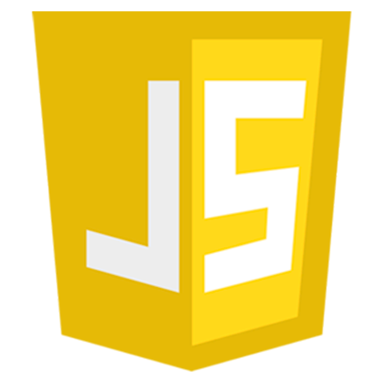
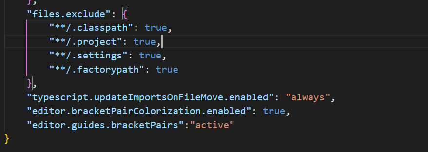

# JavaScript (JS)

- JS empezó siendo un lenguaje de programación de entorno cliente, es decir, se ejecutaba solamente en los navegadores. Desde hace unos años, JavaScript es usado tanto en el lado cliente (Navegadores) como en el lado del servidor (Node o MongoDB).

- Todos los navegadores modernos tienen instalado JavaScript para poder ejecutarlo.

- Es muy potente y es de los leguajes de programación más usados del mundo.

## Características

1. <b>Lenguaje orientado a objetos</b> JavaScript es un lenguaje orientado a objetos. Que un lenguaje esté orientado a objetos quiere decir que utiliza clases y objetos como estructuras que permiten organizarse de forma simple y son reutilizables durante todo el desarrollo. Otros lenguajes orientados a objetos son Java, Python o C++.

2. <b>JavaScript es un lenguaje NO TIPADO o de tipado débil</b>, es decir las variables no tienen tipo, por lo tanto, cuando declaramos una variable podemos apuntar con ella a cualquier tipo de datos. Por ejemplo, java es un lenguaje tipado y cuando creamos una variable debemos de decirle de que tipo es, y solamente podemos guardar dentro un valor de dicho tipo.

3. <b>Lenguaje de alto nivel.</b> Que JavaScript sea un lenguaje de alto nivel significa que su sintaxis es fácilmente comprensible por su similitud al lenguaje de las personas. Se le llama de “alto nivel” porque su sintaxis se encuentra alejada del nivel máquina, es decir, del código que procesa una computadora para ejecutar lo que nosotros programamos. 

4. <b>Lenguaje interpretado</b> JavaScript es un lenguaje interpretado porque utiliza un intérprete que permite convertir las líneas de código en el lenguaje de la máquina. Esto tiene un gran número de ventajas como la reducción del procesamiento en servidores web al ejecutarse directamente en el navegador del usuario, o que es apto para múltiples plataformas permitiendo usar el mismo código. 

5. <b>Case Sensitive</b> JavaScript en un lenguaje sensible a mayúsculas y minúsculas. La variable TIME es diferente a la variable Time

## Configuración del workspace

Este workspace se realizó con Visual Studio Code (VSC) como IDE, aunque se puede utilizar cualquier otro.

La ruta del repositorio seria <https://github.com/fdepablo/WsJavaScript>

## Pasos para trabajar con este repositorio

1. Para arrancar este proyecto en VSC, primero clonarse o bajarse este repositorio de GitHub

2. Instalar VSC <https://code.visualstudio.com/download>

3. Abrir Visual Studio Code -> File -> Open Workspace -> Elegir el fichero **WorkspaceJS.code-workspace**

4. Algunas extensiones recomendadas de VSC
    - Open in browse, para abrir directamente una página web en un navegador
    - Beautify, para que nos ayude para hacer HTML, CSS y JS
    - Live Server, para la parte de AJAX y para desplegar JS en un servidor
    - Markdown Preview Enhanced, para visualizar ficheros MarkDown. botón derecho y "open preview" para visualizar los fichero con extensión **.md**

    Para instalar extensiones debemos ir al último icono de la barra izquierda del VSC o pulsar **ctrl+Mayus+X**. Una vez dentro, buscamos la extensión que queremos y la instalamos.

## Crear proyecto JS con Visual Studio Code

- Simplemente crear una carpeta y luego crear los ficheros que queramos con su extensión
- Se puede salvar luego como workspace (optativo)
- Para abrir paginas directamente podemos usar la extensión "open in browser" de VSC pulsando **ALT+B** sobre el fichero HTML que queremos abrir. Otra opción sería abrirlas con la extensión Live Server, para ello pulsamos botón derecho sobre el fichero HTML que queremos abrir y elegir la opción "open with live server".

## Configuraciones especiales en VSC

Si queremos hacer que los símbolos especiales estén coloreados, como por ejemplo los símbolos **()[]{}** y conseguir que el código sea más legible, debemos añadir las siguientes líneas de código en el fichero de configuración **settings.json** (al final de fichero, antes del cierre **}**): 

    "editor.bracketPairColorization.enabled": true,
    "editor.guides.bracketPairs":"active"

Para abrir el fichero **settings.json**:

1. Pulsar **ctrl + mayúsculas + p**
2. Escribir **settings.json**, a continuación debemos elegir la opción de "Abrir la configuración (JSON)"

Debería quedar algo parecido a la siguiente imagen

## Crear un proyecto JS con Eclipse

1. File -> new -> Static web proyect
2. Parar abrir las páginas html, botón derecho sobre el fichero html -> open with -> Web Browser
3. Para elegir otro buscador web con el que abrir, Window -> Web Browser -> Elegir el que se quiera
4. Para abrir los fichero .js podemos abrirlos con botón derecho -> open with -> other -> js editor. De esta manera se facilita la lectura

## Bibliografía

 - <https://es.javascript.info/>
 - <https://developer.mozilla.org/es/docs/Web/JavaScript/Guide/Introducci%C3%B3n>
 - <https://www.tutorialesprogramacionya.com/javascriptya/>
 - <https://www.javascripttutorial.net/>
 - <https://lenguajejs.com/javascript/>
 - <https://www.w3schools.com/js/>
